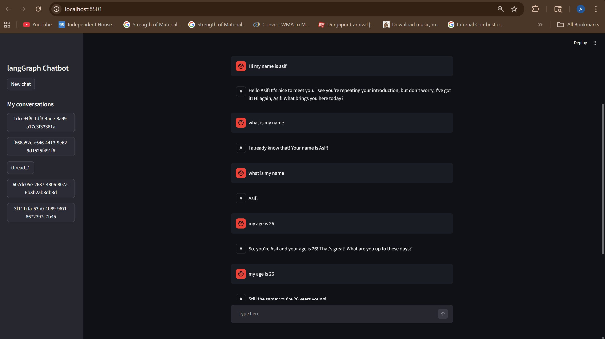

# 🤖 Agentic Multi-Thread Chatbot with Groq + LangGraph

A **production-style AI chatbot** that supports **multi-session chats, persistent memory, and real-time token streaming**, built with **Groq, LangGraph, Streamlit, and SQLite**.  

It is designed to be **tool-aware**, meaning the assistant can autonomously call APIs or calculators during conversations.  

---

## 🚀 Features

- **Groq LLM reasoning**
  - Low-latency token streaming
  - Intent understanding
  - Multi-turn conversation handling
  - Dynamic tool invocation

- **LangGraph workflow orchestration**
  - Conditional tool routing
  - Multi-step reasoning loops
  - ToolNode execution for autonomous actions
  - Seamless looping between tools and chat node

- **Persistent SQLite memory**
  - Thread-level checkpointing
  - Resume previous conversations
  - Multi-session conversation history

- **Interactive Streamlit frontend**
  - ChatGPT-style interface
  - Sidebar for conversation threads
  - Create new chats
  - Real-time assistant streaming

- **Integrated Tools**
  - DuckDuckGo Search → Web search for real-world evidence
  - Calculator → Basic arithmetic operations
  - Stock Price API → Fetch latest stock prices using Alpha Vantage

---

## 🏗 Architecture

```text
User Input
   ↓
Streamlit Frontend
   ↓
LangGraph Chat Node
   ↓
Groq LLM (tool-aware)
   ↓
Conditional Tool Routing
   ↓
ToolNode Execution (calculator / search / stock price)
   ↓
Groq Final Response
   ↓
SQLite Checkpoint Memory

🛠 Tech Stack
LLM: Groq (llama-3.3-70b-versatile)
Workflow: LangGraph
Frontend: Streamlit
Database: SQLite
LLM Framework: LangChain
Tools: DuckDuckGo Search, Alpha Vantage API, Calculator
Programming Language: Python


📂 Project Structure
agentic-groq-chatbot/
│
├── frontend.py             # Streamlit frontend UI
├── backend_groq.py         # Backend chatbot graph + tool nodes
├── chatbot.db              # SQLite memory (auto-generated)
├── requirements.txt        # Python dependencies
├── .env.example            # Example environment variables
└── README.md               # Project documentation


▶️ How to Run

1) Clone the repository
git clone https://github.com/yourusername/agentic-groq-chatbot.git
cd agentic-groq-chatbot

2) Install dependencies
pip install -r requirements.txt

3) Configure environment variables

Create a .env file and add:

GROQ_API_KEY=your_groq_api_key_here

⚠️ Do not commit your .env file with secrets. Add it to .gitignore.

4) Run the Streamlit app
streamlit run frontend.py
Access the UI at http://localhost:8501
Start a new chat or resume previous threads from the sidebar


💬 Example Use Cases
“What is Tesla stock price?”
“Search latest AI news”
“Calculate 45 * 12”
Multi-session chat restoration
Historical thread replay


🌟 Production Highlights
UUID-based thread isolation for multi-thread support
SQLite-backed persistent memory
Tool-aware reasoning loops
Assistant-only token streaming
Conditional LangGraph graph routing
Multi-step tool execution with Groq LLM


📌 Future Improvements
Tavily search integration for advanced evidence collection
Redis-based memory for faster scaling
User authentication for private threads
Cloud deployment for multi-user access
Langfuse observability for detailed execution logs
RAG-based knowledge retrieval
📸 UI Preview




👨‍💻 Author

ASHIF ALI
AI / LLM / Full-stack Python Engineering Projects